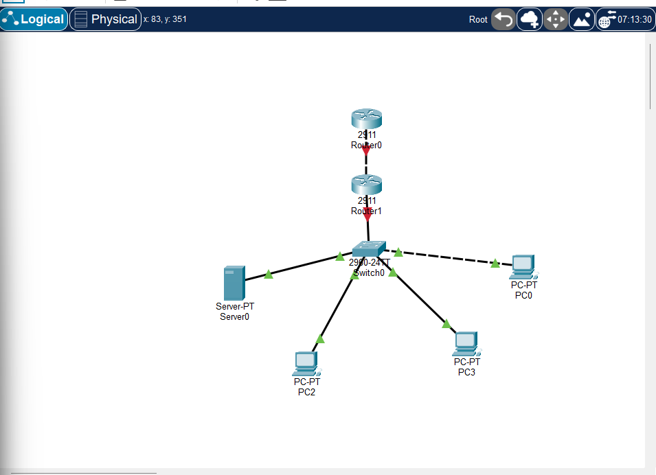

# Lab 01: Secured Campus Network

Cisco Packet Tracer lab covering VLANs, inter-VLAN routing, DHCP, NAT, ACLs, SSH and port security.
Built as part of the Cisco Networking Academy "Network Support and Security" course.

## Topology

| Device | Model | Role |
|---|---|---|
| R1 | Cisco 2911 | Router-on-a-stick, DHCP, NAT, ACL |
| ISP | Cisco 2911 | Simulated ISP / internet (loopback 8.8.8.8) |
| SW1 | Cisco 2960 | Access switch with VLANs and trunk |
| Admin PC, Student PCs | PC | End hosts |
| Srv1 | Server | Server in VLAN 30 |

## Addressing plan

| VLAN | Name | Network | Gateway |
|---|---|---|---|
| 10 | Admin | 192.168.10.0/24 | 192.168.10.1 |
| 20 | Students | 192.168.20.0/24 | 192.168.20.1 |
| 30 | Servers | 192.168.30.0/24 | 192.168.30.1 |
| 99 | Management | 192.168.99.0/24 | 192.168.99.1 |

WAN link: R1 G0/1 (203.0.113.2/30) to ISP G0/0 (203.0.113.1/30).
Srv1 uses the static address 192.168.30.10. SW1 management IP is 192.168.99.2.

## Links

| Link | Ports | Cable |
|---|---|---|
| SW1 to R1 (802.1Q trunk) | SW1 Fa0/1 to R1 G0/0 | Straight-through |
| R1 to ISP | R1 G0/1 to ISP G0/0 | Crossover |
| Admin PC | SW1 Fa0/2 (VLAN 10) | Straight-through |
| Student PCs | SW1 Fa0/3, Fa0/4 (VLAN 20) | Straight-through |
| Srv1 | SW1 Fa0/5 (VLAN 30) | Straight-through |

## What is configured

- VLANs 10, 20, 30, 99 and an 802.1Q trunk with native VLAN 99
- Inter-VLAN routing using router-on-a-stick subinterfaces on R1
- DHCP pools for the Admin and Students VLANs on R1
- NAT overload on R1 with a default route to the ISP
- Extended ACL `STUDENTS-IN`: Students are blocked from the Admin and Management VLANs, everything else is allowed
- SSH version 2 only (telnet disabled) on R1 and SW1
- Port security on PC ports (sticky MAC, maximum 1, violation shutdown); unused switch ports are shut down

## How to open the lab

1. Install Cisco Packet Tracer.
2. Open `campus.pkt`.
3. Device configurations are in `configs/` (`SW1.txt`, `R1.txt`, `ISP.txt`).

## Verification

Screenshots are in `screenshots/`:

- DHCP leases on the PCs (`ipconfig`)
- Inter-VLAN ping between Admin, Students and Servers
- NAT translations on R1 (`show ip nat translations`)
- ACL hit counts (`show access-lists`) and blocked Student to Admin ping
- SSH login from the Admin PC and failed telnet
- Port security status (`show port-security`)

## Notes

- All credentials in the configs are lab-only values and are not used anywhere else.
- Spanning-tree delay can cause the first ping or DHCP request to fail; retry after about 30 seconds.
